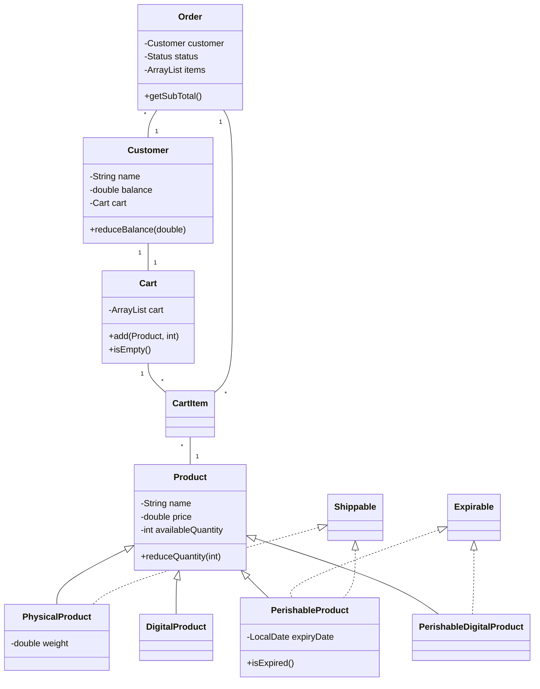

# 🛒 E-Commerce System


A robust, Java-based e-commerce platform implementing advanced object-oriented design principles for seamless product management, shopping experiences, and order processing.

## ✨ Key Features

- **🏷️ Advanced Product Management**
  - Multiple product types (Physical, Digital, Perishable, Perishable Digital)
  - Expiration handling for perishable items
  - Weight tracking for shippable products

- **🛒 Intelligent Shopping Cart**
  - Automatic quantity management
  - Expiration validation
  - Separation of shippable vs digital items

- **💳 Streamlined Order Processing**
  - Integrated payment handling
  - Automated shipping workflow
  - Detailed receipt generation

- **👤 Customer Management**
  - Balance tracking and validation
  - Customer-specific cart association
  - Secure customer information storage

## 🏗️ Architecture Overview



## 📂 Project Structure

```
ecommerce-system/
├── src/
│   ├── models/
│   │   ├── cart/
│   │   │   ├── Cart.java           # Shopping cart management
│   │   │   └── CartItem.java       # Individual cart items
│   │   ├── customer/
│   │   │   └── Customer.java       # Customer information & balance
│   │   └── products/
│   │       ├── impl/
│   │       │   ├── DigitalProduct.java            # Non-physical products
│   │       │   ├── PerishableDigitalProduct.java  # Time-limited digital items
│   │       │   ├── PerishableProduct.java         # Products with expiry dates
│   │       │   └── PhysicalProduct.java           # Tangible products
│   │       ├── Expirable.java      # Interface for expirable products
│   │       ├── Product.java        # Base product class
│   │       └── Shippable.java      # Interface for shippable products
│   ├── services/
│   │   ├── impl/
│   │   │   ├── Order.java          # Order details and management
│   │   │   └── Status.java         # Order status enumeration
│   │   ├── DeliveryService.java    # Interface for delivery methods
│   │   ├── OrderService.java       # Order processing and checkout
│   │   └── ShippingService.java    # Physical delivery handling
│   └── utils/
│       └── LoggerUtil.java         # Logging functionality
```

## 🧩 Design Patterns & Principles

### Applied SOLID Principles:

- **Single Responsibility**: Each class has one specific purpose
- **Open/Closed**: Product hierarchy is open for extension (new product types) but closed for modification
- **Liskov Substitution**: Product subtypes can be used interchangeably
- **Interface Segregation**: Separate interfaces (Expirable, Shippable) for specific behaviors
- **Dependency Inversion**: High-level modules depend on abstractions, not concrete implementations

### Design Patterns:

- **Composite Pattern**: Cart contains CartItems
- **Strategy Pattern**: Different delivery services implement the DeliveryService interface
- **Factory Method**: Creating different product types
- **State Pattern**: Order status management (PENDING, PAID, SHIPPED)

## 💻 Usage Example

```java
// Create a new customer with initial balance
Customer customer = new Customer(
    "John Doe", 
    "john@example.com", 
    "password123", 
    "123-456-7890", 
    1000.0
);

// Create various product types
Product laptop = new PhysicalProduct("Laptop", 899.99, 10, 2000.0);
Product ebook = new DigitalProduct("Java Programming Guide", 29.99, 100);
Product milk = new PerishableProduct(
    "Milk", 
    3.99, 
    50, 
    1000.0, 
    LocalDate.now().plusDays(7)
);

// Get customer's cart and add products
Cart cart = customer.getCart();
cart.add(laptop, 1);
cart.add(ebook, 1);
cart.add(milk, 2);

// Process checkout with shipping address
OrderService orderService = new OrderService();
orderService.checkOut(customer, cart, "123 Main St, City, Country");

// Output will show receipt and shipping confirmation
```

## 🔄 System Flow

```
┌─────────────┐     ┌─────────────┐     ┌─────────────┐     ┌─────────────┐     ┌─────────────┐
│  Customer   │────>│    Cart     │────>│ OrderService│────>│ ShippingServ│────>│ Delivery    │
│ Management  │     │ Management  │     │  Checkout   │     │     ice     │     │ Confirmation │
└─────────────┘     └─────────────┘     └─────────────┘     └─────────────┘     └─────────────┘
                                              │
                                              ▼
                                        ┌─────────────┐
                                        │   Receipt   │
                                        │ Generation  │
                                        └─────────────┘
```

## 🧪 Code Quality & Testing

- **Validation**: Robust input validation for quantities, expiration dates, and customer balance
- **Error Handling**: Clear exception messages for common errors
- **Logging**: Integrated logging system for troubleshooting

## 🚀 Future Enhancements

- 🔐 **User Authentication System**: Secure login and registration
- 💰 **Multi-currency Support**: International pricing capabilities
- 🏷️ **Discount Engine**: Coupons, promotions, and dynamic pricing
- 📊 **Analytics Dashboard**: Sales reports and inventory insights
- 🔔 **Notification System**: Order updates via email/SMS
- 🌐 **Multi-language Support**: Internationalization capabilities

## 📝 Contributing

Contributions are welcome! Please feel free to submit a Pull Request.

## 📜 License

This project is licensed under the MIT License - see the LICENSE file for details.

---

<div align="center">
  <b>Built with ☕ and OOP principles</b>
</div>
